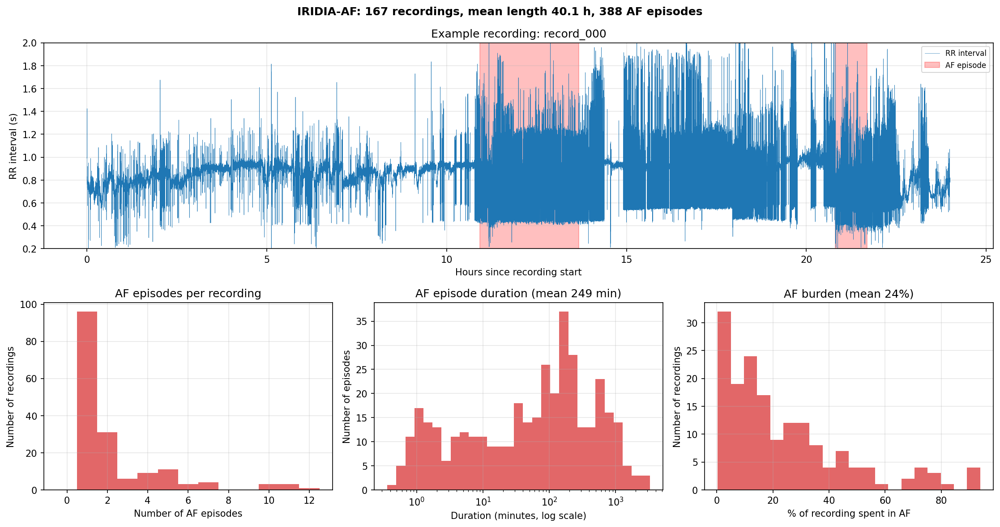
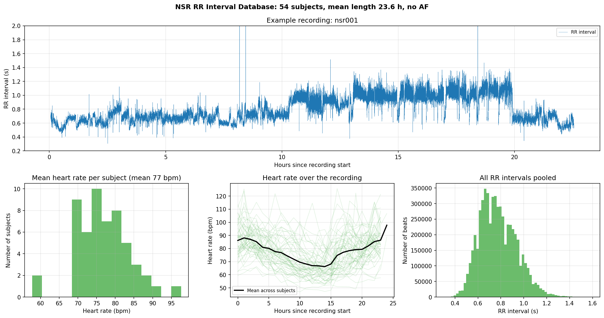
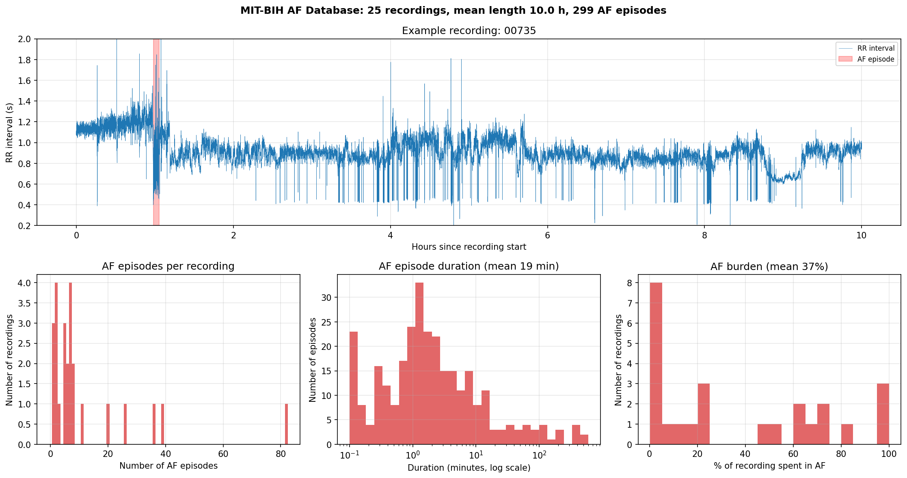
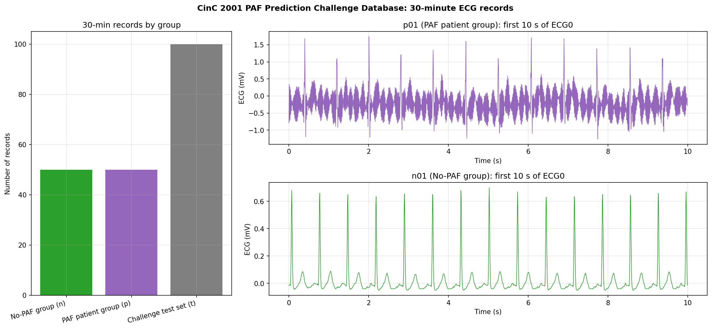
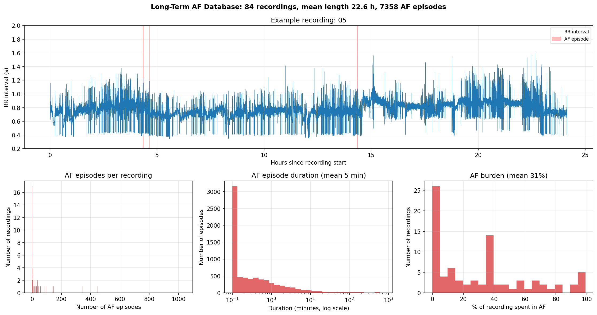
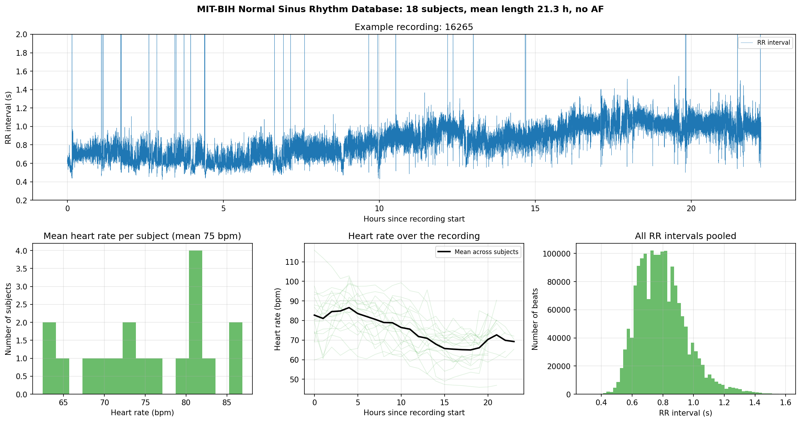

# ECG datasets for atrial fibrillation research

An exploratory overview of public long-term ECG and RR-interval databases containing
atrial fibrillation (AF) and normal sinus rhythm recordings.

## Datasets
| Dataset | Contents | Link |
|---|---|---|
| IRIDIA-AF | Long-term Holter recordings (20–95 h) from patients with paroxysmal AF | [Zenodo](https://zenodo.org/records/8405941) |
| MIT-BIH AF Database | 10-hour recordings from patients with AF | [PhysioNet](https://physionet.org/content/afdb/1.0.0/) |
| Long-Term AF Database | ~24-hour recordings from patients with paroxysmal or sustained AF | [PhysioNet](https://physionet.org/content/ltafdb/1.0.0/) |
| CinC 2001 PAF Prediction | 30-minute ECG records from patients with and without paroxysmal AF | [PhysioNet](https://physionet.org/content/afpdb/1.0.0/) |
| NSR RR Interval Database | 24-hour beat annotations from subjects in normal sinus rhythm | [PhysioNet](https://physionet.org/content/nsr2db/1.0.0/) |
| MIT-BIH Normal Sinus Rhythm | 24-hour recordings from subjects with no significant arrhythmias | [PhysioNet](https://physionet.org/content/nsrdb/1.0.0/) |

Data files are not included in this repository.

## Figures

### IRIDIA-AF

### NSR RR Interval Database

### MIT-BIH AF Database

### CinC 2001 PAF Prediction Challenge Database

### Long-Term AF Database

### MIT-BIH Normal Sinus Rhythm Database

## Data sources
- Gilon C, Grégoire J-M, Mathieu M, Carlier S, Bersini H. IRIDIA-AF, a large paroxysmal
  atrial fibrillation long-term electrocardiogram monitoring database. *Scientific Data* 10, 714 (2023).
- Goldberger AL, et al. PhysioBank, PhysioToolkit, and PhysioNet. *Circulation* 101(23), e215–e220 (2000).
